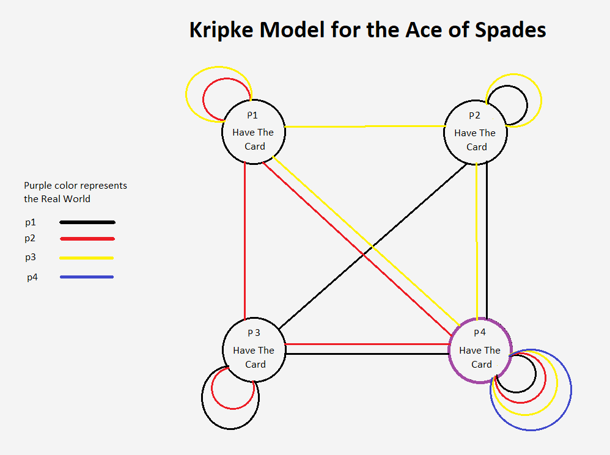

## Introduction

Durak is a card game that is popular in post-Soviet states. The objective of the game is to get rid of all one's cards when there are no more cards left in the deck. At the end of the game, the last player with cards in their hand is the *fool*.

## Task Description

### Game rules:
#### a. *Setup*: 
The game is typically played with two to six people, using a deck of 36 cards, for example a standard 52-card deck from which the numerical cards 2 through 5 have been removed. The game can be played with six people if desired. The deck is shuffled, and each player receives six cards. The bottom card of the remaining deck is laid open on the table. This determines the trump suit. The remainder of the deck is then placed on top of the revealed card at a 90 degree angle, so that it remains visible, forming a draw pile called the prikup ("talon"). The revealed card remains part of the talon and is drawn as the last card. Cards discarded due to successful defenses are placed in a discard pile next to the talon.

#### b. *Game start*: 
The player with the lowest trump is the first attacker. The player to the attacker's left is always the defender. After each turn play proceeds clockwise. If the attack succeeds (see below), the defender loses their turn and the attack passes to the player on the defender's left. If the attack fails, the defender becomes the next attacker.

#### c. *Attack*: 
The attacker opens the turn by playing one card face up on the table as an attacking card. The player to the attacker's left is the defender. In the basic *podkidnoy* (подкидной, "throw-in") variant, and in most other variants of “durak”, the defender has to immediately attempt defense in response to the initial attack. Ace is the highest rank and six is the lowest. Trumps always beat non-trump cards regardless of rank.

#### d. *Defense*: 
The defender attempts to beat the attacking cards by playing higher-valued defending cards from their hand. One card is played to defend against each attacking card, and it must be in the attacking card's suit or the trump suit. The defending cards are placed on top of the attacking cards so that players can keep track of which card is defending against which. At any point during a defense, all players other than the defender can add extra attacking cards, provided that for each new attacking card, there is already a card of the same rank on the table (either defending or attacking), and the total number of attacking cards does not exceed the number of cards in the
defender's hand. The defender must also defend against these new cards. If at any point multiple players wish to add cards simultaneously, the first attacker has first priority, then the player to defender's left, and so forth clockwise. At any point during the turn, a defender unwilling or unable to beat all attacking cards may abandon the defense by picking up all the cards on the table. This ends the turn. The failed defender loses their turn to attack; hence the player to the defender's left attacks next. If, however, the defender has beaten all attacking cards, and no other players are willing or able to add more, the defender has triumphed. The turn ends, all cards on the table are placed in the discard pile, and play passes to the left: the successful defender opens the next turn as the new attacker. No players may examine the discard pile at any point.

#### e. *End of turn*: 
At the end of each turn, whether or not the defense was successful, each player draws until they have six cards in their hand or the talon is exhausted. The main attackerdraws as many cards as necessary first, followed by any other attackers in clockwise order, and finally the defender. Once the talon is empty, play continues without further drawing. Players who exhaust their hands leave the game.

#### f. *Winning or losing*:
The last person left with cards in their hand is the loser (the *fool* or *"durak"*).

____________________
____________________

## Implementation Progress

We've built a basic implementation of the game using python. 

### Card

The Card class is used to represent the cards present in a game of Durak. When a game starts one instance of the Card class is instantiated for each of the 36 cards. There are 4 suits: hearts, diamonds, clubs and spades and 9 different values for each suit from 6 to Ace.

### Game

The Game class runs the game of Durak. It knows about the players, all the cards, the deck, the discard pile and the common knowledge between the players. It takes care of attack cycles, turn taking, updating common knowledge and checking win conditions.

### Player

The Player class implements all the logic for a player in the game of Durak, including decision making. It knows which game it is playing, which hand it has and has knowledge of where all the cards in the game are. This knowledge is represented as a hashmap where the keys are instances of the Card class and the values are lists of places the card can be. (in the player's own hand, another player's hand, the deck or the discard pile)

### Computer

Computer is an extension of the Player class in which the game logic for the AI is implemented. The relevant method here is playCard(), which allows the player to choose a card from their hand that it wants to play. The method is invoked by Game and returns a Card object.

### User

User is an extension of the Player class and implements the decision making for the human player in the game. The simple implementation shows the user their hand and allows them to pick a card using a command prompt when it is the user's turn. If we build a GUI for the game, we should be able to easily hook this class up to click events in the user interface.

____________________

## Kripke Models

We implemented a separate Kripke model for each card. Each world in a kripke model represents a world in which one of the players has that specific card. For example, if there are 2 players and there is a kripke model for the ace of spades, there are two possible worlds: one in which player 1 has the ace of spades and a world in which player 2 has the ace of spades.
An example of what such a Kripke model looks like for 4 players is shown in the image above. Player 4 has the ace of spades and thus only considers it possible that he has the card in his hand. The other three players that do not have the card, only consider it possible that one of the other players has the card, because they know they do not have the card themselves. There are reflexive relations to each world, because we are working in S5.

____________________

## Future Improvements

- Build a UI for better representation of the game as stated above. 

- Extend the game to more or less players (2-6), however it is not exactly the goal of this course. 

- Implement different types of player behaviour for AI players. For example: 'aggressive' player (who would attack and risk more), 'cautious' player(who would attack and risk less and defend more), 'moderate' player (medium levels of aggresiveness and cautiousness). 

- Try AI players determine the type of player they play against using knowledge database and change its own tactics based on that (needs the previous point with 'types of players' to be implemented).  

____________________

## About the Project:

This game is part of the final Project for the course [Multi-Agent Systems](https://www.rug.nl/ocasys/rug/vak/show?code=KIM.MAS03) at the [University of Groningen](https://www.rug.nl/). The project is developed by a team of three members:

1. Alex Tatarov (s3401332)
2. Micha de Rijk (s2671492)
3. Md. Ataur Rahman (s3521346)
